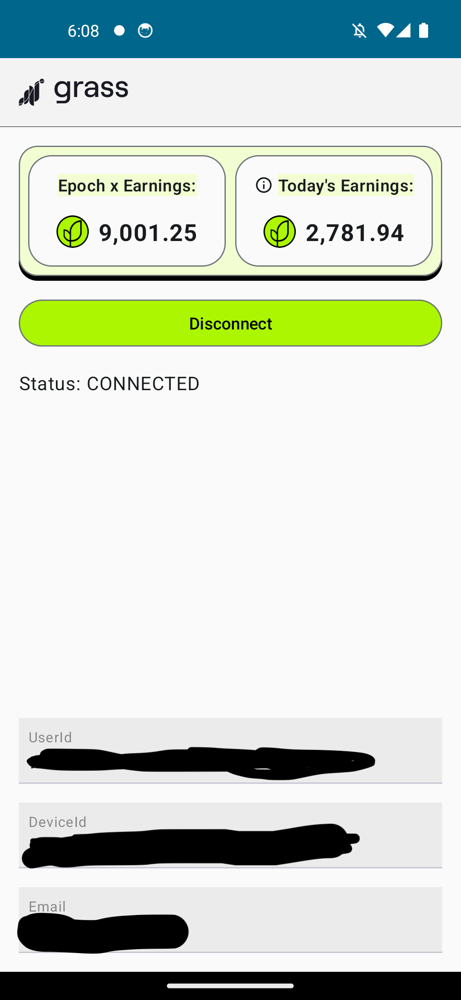

# [Getgrass.io](https://www.getgrass.io/) Airdrop Farming

First setup from browser by installing extension for the first time and then install this on your android device to start farming on background.

